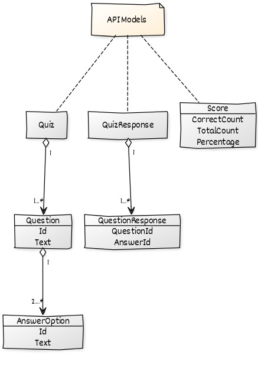
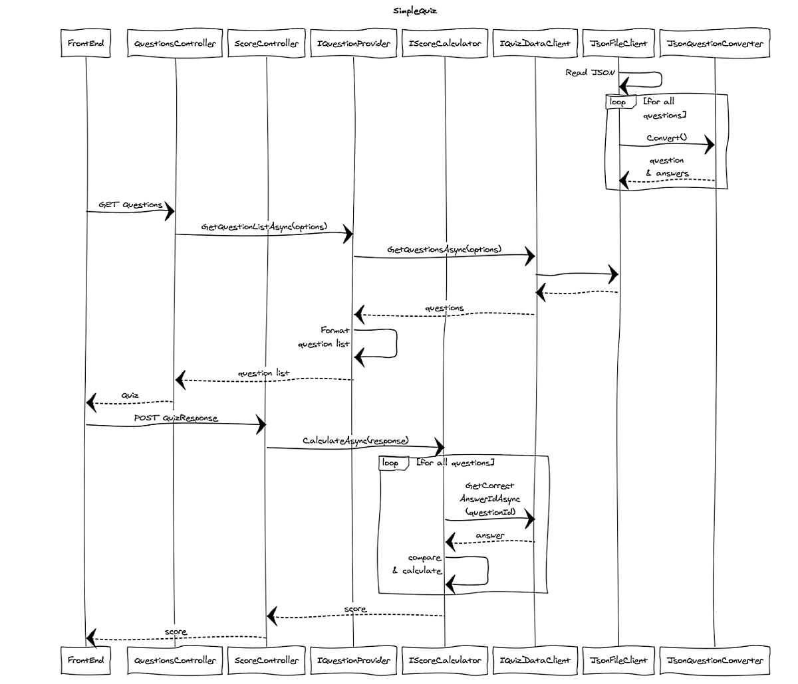

# SimpleQuiz

## Deployment
	
* Backend : http://localhost:5000/
* Frontend : http://localhost:4200/

## Design

[Data model](http://yuml.me)


```
// SimpleQuiz API Models
// ------------------
[note:API Models {bg:papayawhip}]-[Quiz]
[note:API Models {bg:papayawhip}]-[QuizResponse]
[note:API Models {bg:papayawhip}]-[Score]
[Quiz]<>1-1...*>[Question|Id;Text]<>1-2...*>[AnswerOption|Id;Text]
[QuizResponse]<>1-1...*>[QuestionResponse|QuestionId;AnswerId]
[Score|CorrectCount;TotalCount;Percentage]
```

[Sequence diagram](https://www.websequencediagrams.com/)


```
title SimpleQuiz

participant FrontEnd
participant QuestionsController
participant ScoreController
participant IQuestionProvider
participant IScoreCalculator
participant IQuizDataClient
participant JsonFileClient
participant JsonQuestionConverter

JsonFileClient->JsonFileClient: Read JSON
loop for all questions
    JsonFileClient->JsonQuestionConverter: Convert()
    JsonQuestionConverter-->JsonFileClient: question\n& answers
end
FrontEnd->QuestionsController: GET Questions
QuestionsController->IQuestionProvider: GetQuestionListAsync(options)
IQuestionProvider->IQuizDataClient: GetQuestionsAsync(options)
IQuizDataClient->JsonFileClient: 
JsonFileClient-->IQuizDataClient: 
IQuizDataClient-->IQuestionProvider: questions
IQuestionProvider->IQuestionProvider: Format \nquestion list
IQuestionProvider-->QuestionsController: question list
QuestionsController-->FrontEnd: Quiz

FrontEnd->ScoreController: POST QuizResponse
ScoreController->IScoreCalculator: CalculateAsync(response)
loop for all questions
    IScoreCalculator->IQuizDataClient: GetCorrect\nAnswerIdAsync\n(questionId)
    IQuizDataClient-->IScoreCalculator: answer
    IScoreCalculator->IScoreCalculator: compare\n& calculate
end
IScoreCalculator-->ScoreController: score
ScoreController-->FrontEnd: score
```
